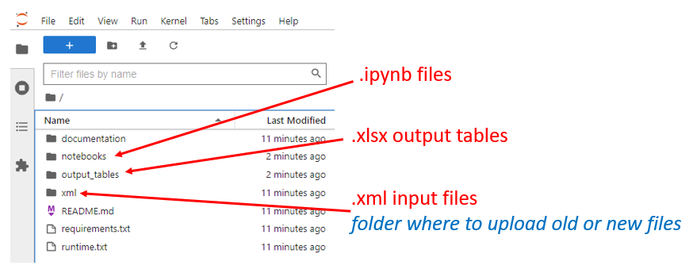
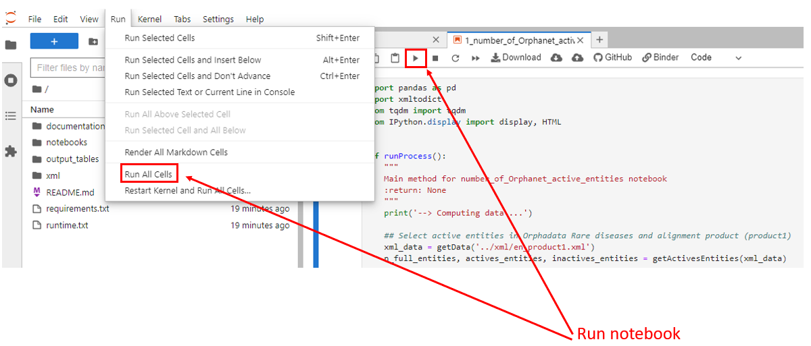
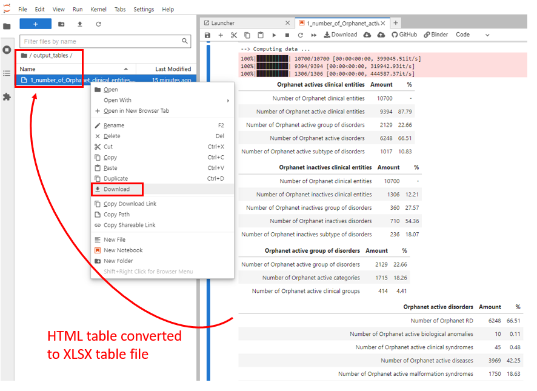
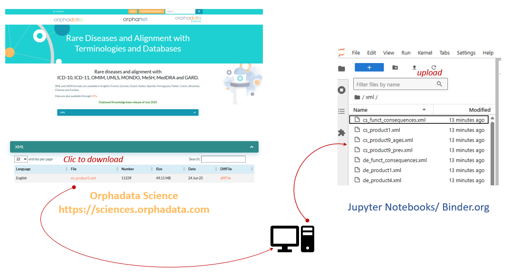

# Binder/Docker for Jupyter Notebook Orphanet Nomenclature

Data metrics from the Orphanet nomenclature of rare diseases are computed by using the Orphanet Scientific Knowledge Base products (https://sciences.orphadata.com/orphanet-scientific-knowledge-files/) delivered on the Orphadata.com website (https://www.orphadata.com).  
These products, structured in an Extensible Markup Language (XML) file format, are produced twice a year (in July and December) by employing in-house backoffice tools as an ETL (Extract Transform Load).  
For this study we selected 4 different products of the July 2025 version of Orphadata: 
- the “rare diseases and alignments with terminologies and databases” product (<iso>_product1.xml) in english, czech dutch, french, german, italian, polish, portuguese and spanish languages, the “linearization of rare diseases” english product (en_product7.xml)
- the “genes associated with rare diseases” english product product (en_product6.xml).
- all the “classifications of rare diseases” english products (en_product3_<x>.xml)  
  
All metrics were computed by using Python 3.8 scripts freely available in dedicated Jupyter Notebooks (ipynb files in the notebook folder).  
This repository publicly serves these reproducible and interactive computational environments capable to calculate metrics on demand.  
If needed, note that user can download last updated Orphadata.com products and upload them in the dedicated xml folder.
To this end, user is able to compute metrics related to a date of products version.
In the same way, reader is able to run metrics on older products versions by downloading related files from our dedicated Github repository (https://github.com/Orphanet/Orphadata_aggregated)

## Executing program
Click below to run Binder

## Running Scripts

In order to run the different notebooks:
- please navigate in notebooks directory:

- open one by double-click.
- run it by selecting run all cells in Run menu	 	 OR click the dedicated button OR type SHIFT+ENTER

## Visualizing Results

User can analyze results directly on the right and side HTML tables outputed by the script.  
But user could also download related XLSX tables from the output_tables folder:  

## Upload another XML file

User can compute metrics with older or newer Orphdata files. User needs to download the related XML file from the Orphanet Scientific Knowledge Files dedicated page
and upload it to the Binder/Jupyter notebook XML directory.

## Authors

Caterina Lucano
[@caterina.lucano@inserm.fr]  
David Lagorce 
[@david.lagorce@inserm.fr]  
Valérie Serrière-Lanneau
[@valerie.lanneau@inserm.fr]  
Marc Hanauer 
[@marc.hanauer@inserm.fr]  
Ana Rath
[@ana.rath@inserm.fr]  
